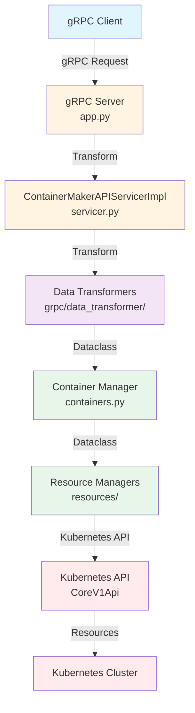
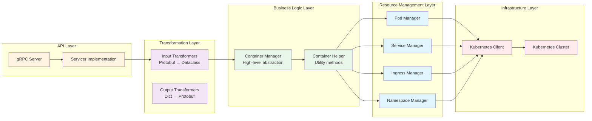
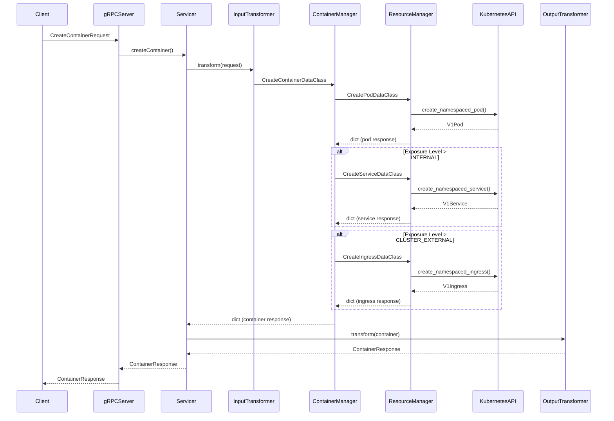
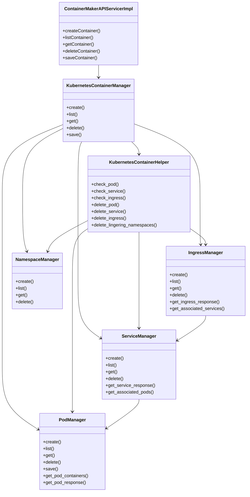
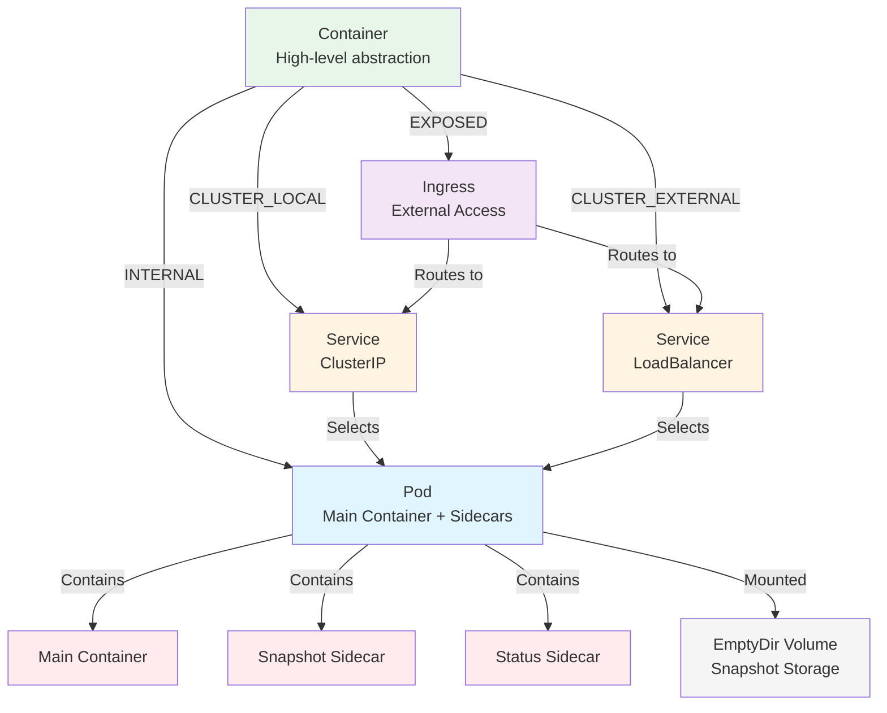
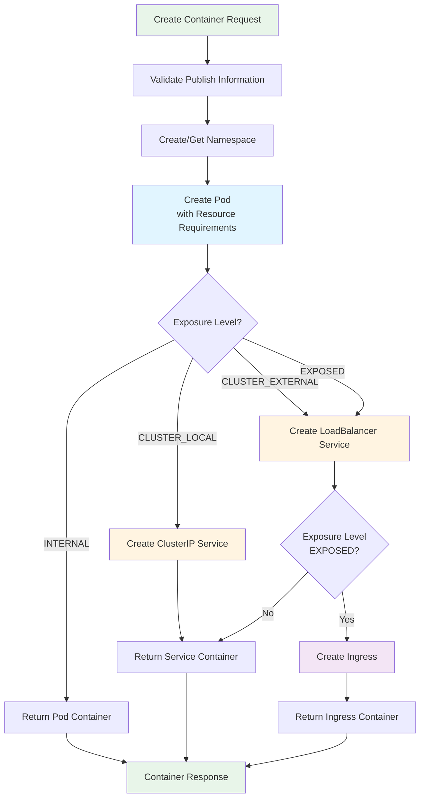
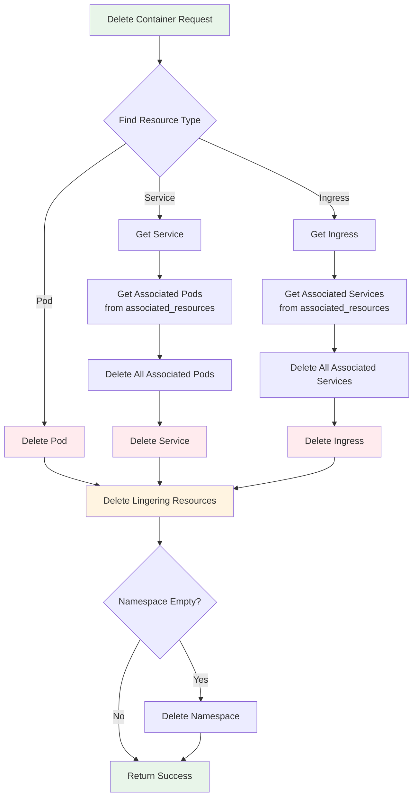

# Container Maker Architecture

## Overview

Container Maker is a Kubernetes-native microservice that provides a high-level abstraction for managing containers (pods, services, and ingresses) through a gRPC API. It simplifies container lifecycle management by handling resource creation, deletion, and cascading relationships automatically.

## System Architecture



## Layered Architecture



## Request Flow



## Component Relationships



## Resource Hierarchy



## Container Creation Flow



## Container Deletion Flow



## Data Structures

### Container Response Format

```python
{
    'container_type': 'pod' | 'service' | 'ingress',
    'container_id': str,  # UUID from Kubernetes resource
    'container_name': str,
    'container_ip': str,
    'container_network': str,  # Namespace name
    'container_ports': list[dict],
    'container_resources': dict,  # Only in create response
    'container_associated_resources': dict  # Nested resource hierarchy
}
```

### Associated Resources Structure

```python
# For Pod:
container_associated_resources = {}  # Empty, pods have no dependencies

# For Service:
container_associated_resources = {
    'pods': [
        {
            'resource_type': 'pod',
            'pod_id': str,
            'pod_name': str,
            'associated_resources': [
                {
                    'resource_type': 'pod_container',
                    'container_name': str,
                    'container_resources': dict
                }
            ]
        }
    ]
}

# For Ingress:
container_associated_resources = {
    'services': [
        {
            'resource_type': 'service',
            'service_id': str,
            'service_name': str,
            'associated_resources': [
                {
                    'resource_type': 'pod',
                    'pod_id': str,
                    'pod_name': str,
                    'associated_resources': [...]
                }
            ]
        }
    ]
}
```

## Pod Structure

Each pod created by Container Maker contains three containers:

1. **Main Container**: User's application container
2. **Snapshot Sidecar**: Handles filesystem snapshots for save operations
3. **Status Sidecar**: Monitors and reports container status

All containers share:
- Resource limits (CPU, memory, ephemeral storage)
- Security context (privileged mode)
- Volume mounts (snapshot volume for main + snapshot sidecar)

## Resource Requirements

Default resource limits applied to all containers:

- **CPU**: Request `100m`, Limit `1`
- **Memory**: Request `256Mi`, Limit `1Gi`
- **Ephemeral Storage**: Request `512Mi`, Limit `1Gi`
- **Snapshot Volume**: Size limit `2Gi` (EmptyDir)

## Key Design Decisions

1. **Layered Abstraction**: Container Manager provides a high-level API that abstracts away Kubernetes complexity
2. **Cascading Deletes**: Deleting a container automatically deletes all associated resources
3. **Exposure Levels**: Four levels (INTERNAL, CLUSTER_LOCAL, CLUSTER_EXTERNAL, EXPOSED) determine which resources are created
4. **Unified Response Format**: All resources return consistent response structures with `resource_type` and `associated_resources`
5. **Resource Deduplication**: List operation excludes nested resources (pods in services, services in ingresses)
6. **Automatic Namespace Management**: Namespaces are created automatically and cleaned up when empty

## Error Handling

Errors are propagated through layers:
- Kubernetes API errors → `ApiException`
- Timeout errors → `TimeoutError`
- Runtime environment mismatches → `UnsupportedRuntimeEnvironment`
- All errors are wrapped with context and re-raised

## Testing Strategy

- **Unit Tests**: Data transformers (Protobuf ↔ Dataclass)
- **Integration Tests**: Resource managers (Pod, Service, Ingress)
- **Integration Tests**: Container manager (Create, List, Get, Delete, Save)
- **Integration Tests**: gRPC servicer (end-to-end API tests)

Tests use real Kubernetes clusters and clean up resources automatically.

